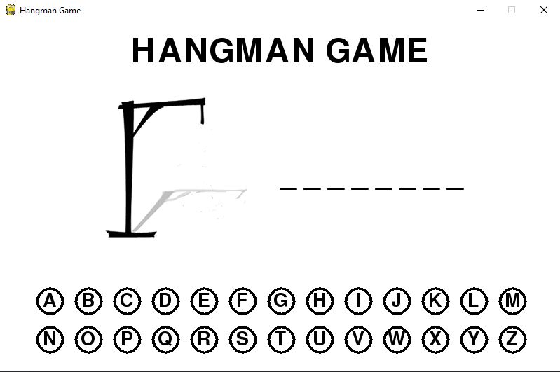
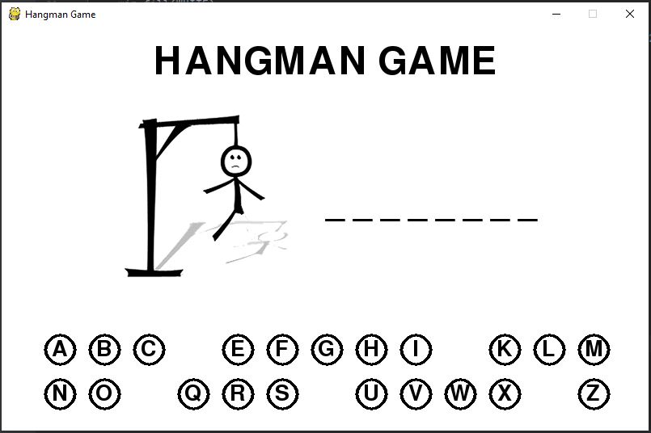

# Hangman-Game
> Simple hangman game created using Pygames

## Table of contents
* [General info](#general-info)
* [Screenshots](#screenshots)
* [Technologies](#technologies)
* [Setup](#setup)
* [Features](#features)
* [Status](#status)
* [Inspiration](#inspiration)
* [Contact](#contact)

## General info
Simple hangman game were you can guess the word by selecting the correct letter from the on screen buttons. 

## Screenshots

## Technologies
* Python - version 3.7
* Pygames

## Setup
To run this project download the files and run the code in any interpreter. 

## Features
List of features ready and TODOs for future development
* Has a set of images that appears when player select the wrong letter and creates the "hangman".
* When a letter is selected, it disappears, so the player cannot use it again.
* It contains a set of words that are chosen randomly at the beginning of the game.

To-do list:
* Feature that would automaticly generate new words befor the starto of a new game.

## Status
Project completed. 

## Inspiration
Inspired by youtube channel: Tech With Tim

## Contact
[@Piotr Kowalewski](https://pkow.herokuapp.com) - feel free to contact me!
